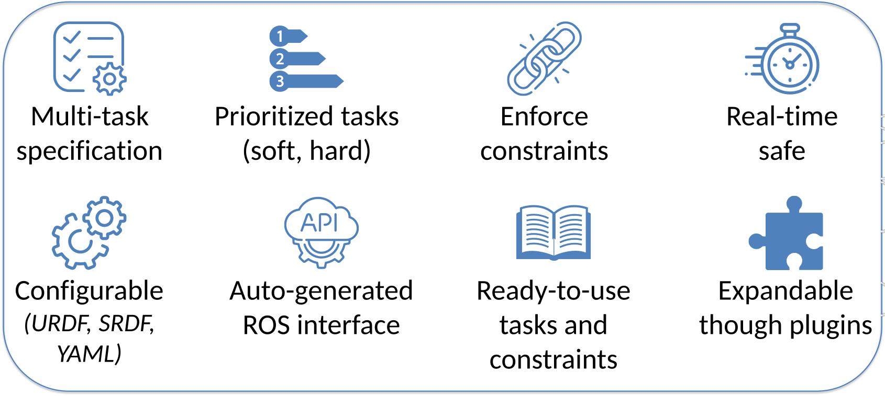

.. CartesIO documentation master file, created by
   sphinx-quickstart on Thu Jan 30 12:45:00 2020.
   You can adapt this file completely to your liking, but it should at least
   contain the root `toctree` directive.

Welcome to CartesI/O's documentation!
=====================================
A novel Cartesian control framework with a focus on online
control of multi-chained, hyper-redundant floating-base
robots!

Features
--------

|
|

- **multiple task** specification
- ability to enforce soft **priorities** as well as hard priorities
  between tasks
- ability to specify **constraints** in the task execution
- small computation time (suitable for **online execution**)
- possibility to execute inside a **real-time** thread in order
  to reduce delays and jitter
- ease of configuration and use, **quick setup** time and
  ready to use control tools
- parametrized with **standard** description formats (e.g.
  URDF) in order to support multiple platforms
- handling of floating base robots
- heavily **customizable** through plugins, at almost all layers

How to install
--------------
A binary distribution is available by adding a new source (with the corresponding GPG key) to 
``apt``, and then invoking the usual *update*/*install* commands:

 - ``sudo sh -c 'echo "deb http://xbot.cloud/xbot2/ubuntu/$(lsb_release -sc) /" > /etc/apt/sources.list.d/xbot-latest.list'``
 - ``wget -q -O - http://xbot.cloud/xbot2/ubuntu/KEY.gpg | sudo apt-key add -``
 - ``sudo apt update``
 - ``sudo apt install cartesian_interface``

To use the software, sourcing the installed environment script is required.
You can add the line ``source /opt/xbot/setup.sh`` to your ``.bashrc`` file.

Cite our work
-------------
..with the bibtex below!

.. code-block:: latex

    @inproceedings{laurenzi19cartesio,
    author={A. {Laurenzi} and E. M. {Hoffman} and L. {Muratore} and N. G. {Tsagarakis}},
    booktitle={2019 International Conference on Robotics and Automation (ICRA)},
    title={{CartesI/O: A ROS Based Real-Time Capable Cartesian Control Framework}},
    year={2019},
    pages={591-596},
    doi={10.1109/ICRA.2019.8794464},
    ISSN={1050-4729},
    month={May},}

Contents
--------
Start from :ref:`here<quickstart>`!

.. toctree::
   :maxdepth: 2
   :caption: Design and usage

   quickstart
   design
   problemdesc
   rosapi
   progr_cpp
   progr_py
   plugins
   porting

.. toctree::
   :maxdepth: 2
   :caption: API reference

   reference/cartesian_ifc
   reference/problem
   reference/trajectory
   reference/sdk

.. Indices and tables
.. ==================

.. * :ref:`genindex`
.. * :ref:`modindex`
.. * :ref:`search`

